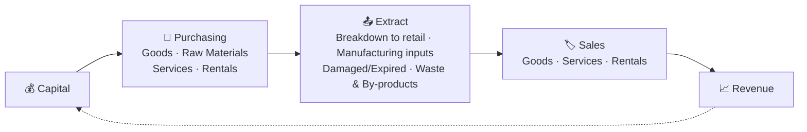
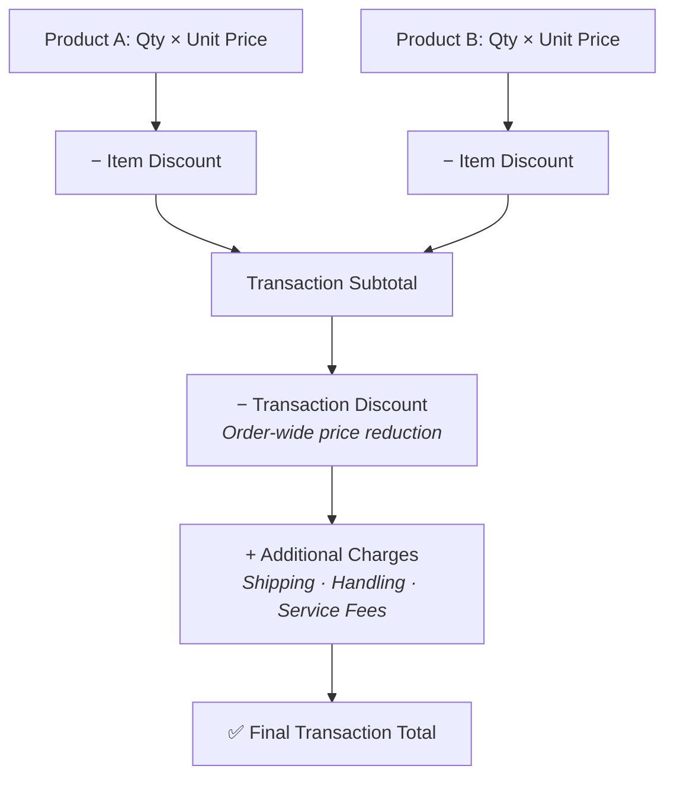
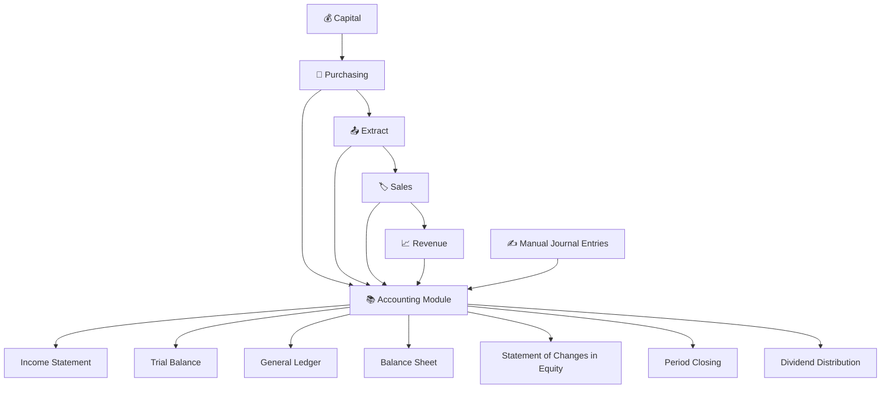
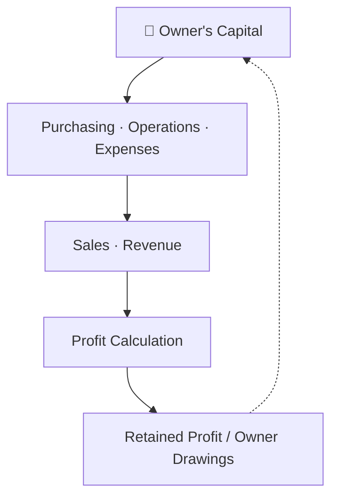
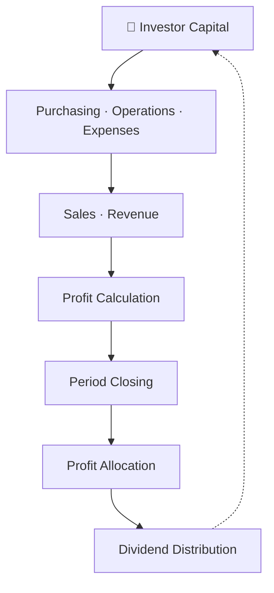
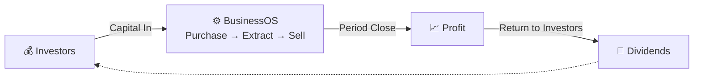

# Hi, I’m **Putra Adiatma** 👋  

## About Me  

I help businesses **solve operational and scalability problems** by designing and building **reliable information systems**.  

My focus is not on using many technologies, but on **choosing the right architecture and implementation** so systems are:
- usable in real operations  
- scalable as the business grows  
- maintainable in the long term  

I work end-to-end: **understanding business processes → translating them into system logic → delivering working software**.

---

## 🎯 What I Do  

- Transform **manual or fragmented business processes** into integrated digital systems  
- Design **transaction-critical systems** (billing, payments, sales, inventory)  
- Build **real-time and high-concurrency applications** for growing businesses  
- Reduce development and operational friction through **automation and system standardization**

> Programming languages and frameworks are tools — **business outcomes are the goal**.

---

# BusinessOS

**Adaptive Business Operations & Financial Management Platform**

> Tools kept simple. Business logic built to bend with you.

Most business software starts by asking you to squeeze your company into someone else's idea of how things should work. BusinessOS takes a different approach. Instead of stacking on rigid modules with fixed workflows, it gives you a small set of core tools — **Purchasing**, **Extract**, and **Sales** — that you combine however your business actually needs them combined.

Running a single small shop? These tools work. Running a multi-branch company with several investors? Same tools, same logic, just used more deeply.

Think of it less like a traditional ERP and more like a calculator. A calculator doesn't tell you what to compute — it just gives you the operations, and your own knowledge decides what to build with them. That's the philosophy behind BusinessOS.

**Easy to start. Deep to master.**

---

## What Makes BusinessOS Different?

Typical enterprise software asks: *"What workflow does your company use?"* — and then tries to force you into it.

BusinessOS asks something different: *"What are you actually trying to achieve? How can these tools help you represent that?"*

We build the tools. You bring the business knowledge. Put the two together, and you end up with a workflow that's genuinely yours — not a generic template you had to adapt around.

If you already understand how purchasing, sales, manufacturing, expenses, payroll, inventory, costing, revenue, capital, and accounting fit together in your business, you'll find that combining the same few tools in different ways unlocks a surprising amount of power. It works a bit like a spreadsheet: the deeper your understanding, the more it can do for you.

---

## Three Core Primitives. Endless Combinations.

At the heart of BusinessOS are just three fundamental operations. Rather than a separate module for every possible scenario, these three primitives combine to represent retail, wholesale, manufacturing, rentals, services — pretty much any business model you can throw at it.

| Primitive | What It Does |
|---|---|
| 🛒 **Purchasing** | Turns capital into goods, materials, services, or leased resources. Adds to inventory, creates liabilities, or records expenses directly — whatever the transaction calls for. |
| 📤 **Extract** | Takes items out of inventory without treating it as a sale. Use it for breaking bulk, issuing materials into production, writing off expired stock, or tracking waste and by-products. |
| 🏷️ **Sales** | Converts goods, services, or rentals back into revenue. It works the same whether you're ringing up a retail sale, booking a rental, or invoicing a client for services. |

The goal was never to build a module for every possible scenario. It was to give you flexible primitives that, combined thoughtfully, can represent almost all of them.

---

## Pricing That Flexes With Your Transactions

Purchasing and Sales share the same pricing engine underneath — detailed enough to handle complex commercial deals, but simple enough that everyday retail sales don't feel over-engineered.

Apply discounts line by line, or across the whole order. Add shipping, handling, or service fees separately when they apply. Record everything as cash or credit — the same pricing logic holds whether you're dealing with goods, services, or rentals.

---

## Every Transaction Flows Straight Into Accounting

Nothing you record just sits there. Every Purchasing, Extract, and Sales entry automatically feeds the **Accounting Module**, continuously updating your standard financial reports in the background. Need to make an adjustment or correction outside the normal flow? You can post manual journal entries directly, too.

### Reports Included

- 📊 **Income Statement** — revenue, costs, expenses, and net profit for any period you choose
- ⚖️ **Trial Balance** — debit/credit balances per account, so you can always confirm the books are balanced
- 📖 **General Ledger** — the full transaction history behind every account balance
- 🧾 **Balance Sheet** — a complete snapshot of assets, liabilities, and equity
- 💹 **Statement of Changes in Equity** — tracks how owner or investor capital moves: contributions, profits, withdrawals, dividends
- 📅 **Period Closing** — locks transactions, rolls income/expense balances into retained earnings, and opens a clean set of books for the next period
- 💵 **Dividend Distribution** — allocates profit to investors proportionally and keeps a payment history per stakeholder

Because every operational entry posts automatically, your reports are always current — no end-of-month scramble to reconcile things by hand. Manual entries stay available for the edge cases. Period closing gives you a clean financial line in the sand, and dividend distribution connects your results directly back to the people who invested in the business.

---

## Ownership & Capital Models

BusinessOS supports two ownership structures, both running on the same core engine underneath.

### 👤 Sole Proprietorship / Privately Owned

Keeps business operations cleanly separated from personal withdrawals, while still giving you a continuous, honest read on how the business is actually performing.

### 💼 Multi-Investor / Partnership

Tracks capital contributions, operations, profitability, period closing, and profit distribution across multiple stakeholders — all in one continuous financial flow, without needing a separate system bolted on the side.

---

## The Full Cycle: From Capital to Profit

This is really the heartbeat of the whole platform — capital comes in, flows through operations, turns into profit, and eventually finds its way back to the people who put it in.

> An animated version of this flow is available as <a href="https://putraadiatma64bit.github.io/project/" target="_blank">this animated version</a>.
---

## One Platform. Every Business Model.

Works well for: **Retail · Wholesale · Manufacturing · Services · Rentals · Sole Ownership · Multi-Investor · Multi-Branch · Multi-Division**

Handles just about every transaction type you'll run into: **Goods · Services · Rentals · Expenses · Loans · Returns · Production · Payroll · Inventory · Expiry · Waste & By-products · Capital · Revenue · Profit · Dividends · Period Closing**

### Deployment: Standalone or Multi-Node

- 💻 **Standalone** — Runs on a single PC. A great fit for small businesses or a solo operator.
- 🌐 **Multi-Node** — A centralized server setup serving multiple branches, business units, or divisions.

The same operational model scales without drama — from one laptop run by one owner, all the way up to a distributed network spanning several organizations.

---

## Our Philosophy

> Business doesn't get simpler just because the software has more modules.

We built BusinessOS on the opposite idea: a handful of fundamental tools, combined flexibly, kept simple to operate on the surface — but backed by business logic that can go as deep as you need it to.

**Simple on the surface. Flexible underneath. Powerful in the hands of those who truly understand their business.**

---

## Tech Stack

- **Frontend & Backend:** Elixir Phoenix
- **Database:** PostgreSQL

## Download

- 🔗 Windows 10/11 (64-bit) — Rupiah (IDR): [Download](https://bit.ly/4wNK7iD)
- 🔗 Windows 10/11 (64-bit) — US Dollar (USD): [Download](https://bit.ly/4qAJZBy)
---

## 📫 Let’s Connect  

[LinkedIn – Putra Adiatma](https://www.linkedin.com/in/putra-adiatma-64bit/)  

---

⭐️ *Focused on building systems that actually get used — and keep working as the business grows.*
