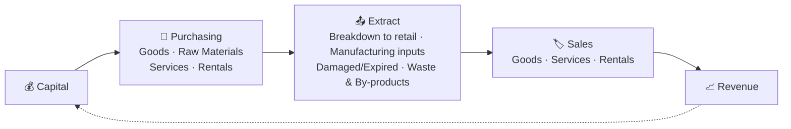
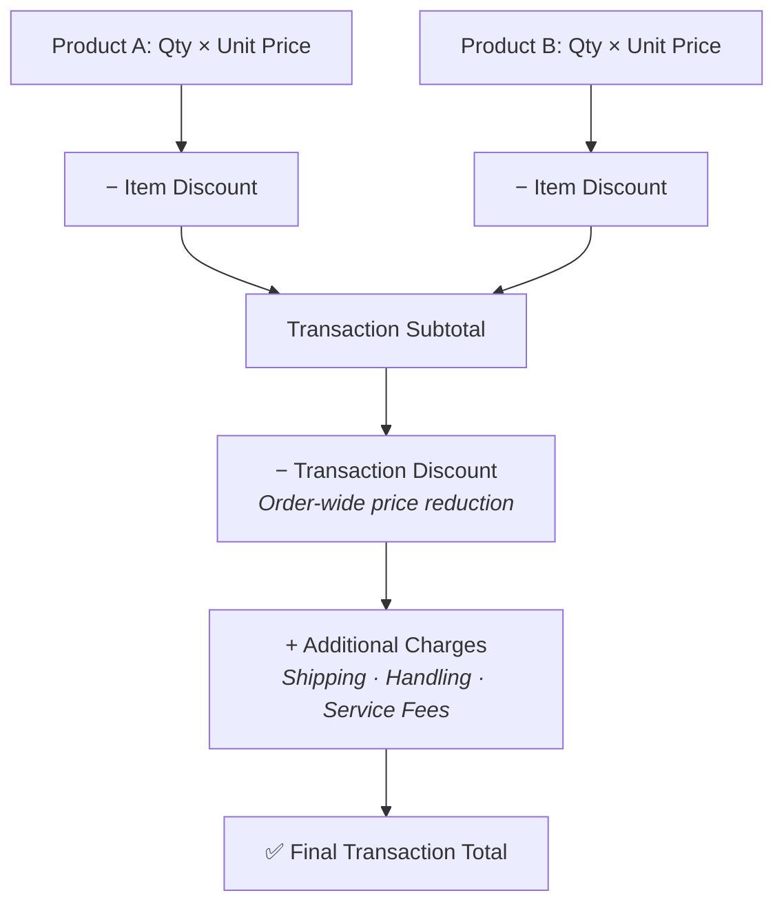
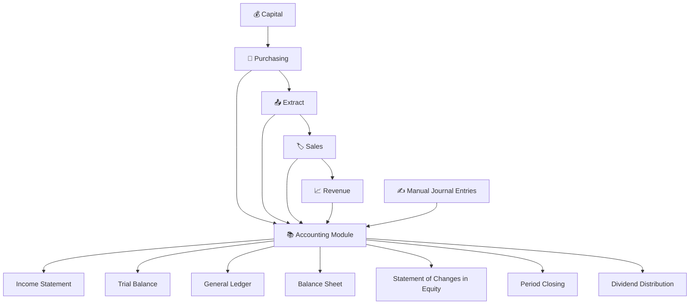
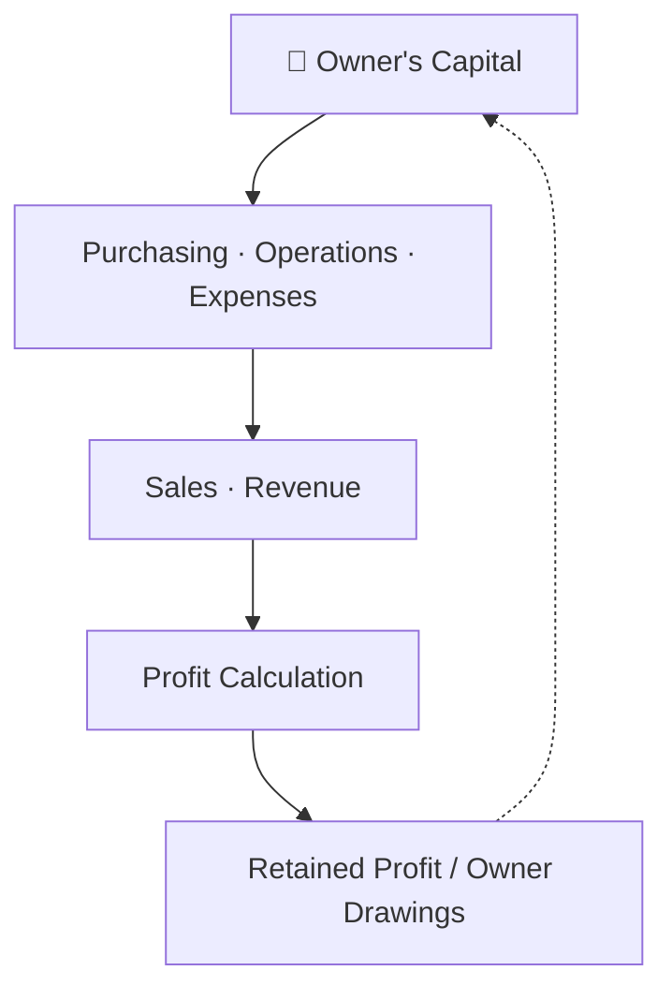
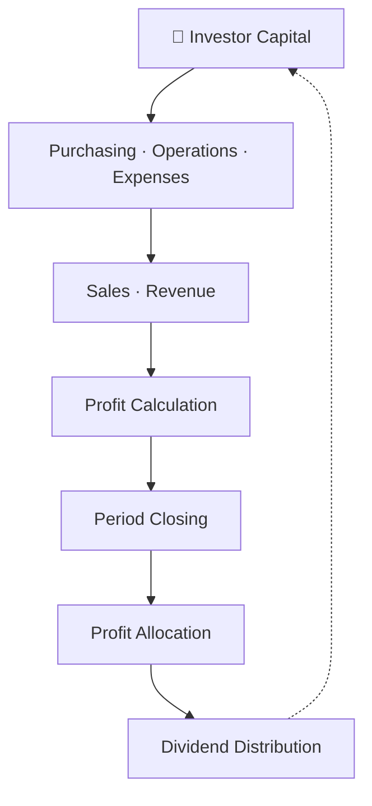
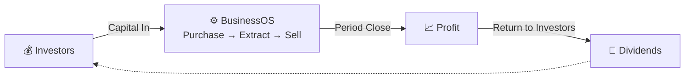

# Hi, I’m **Putra Adiatma** 👋  

## About Me  

I help businesses **solve operational and scalability problems** by designing and building **reliable information systems**.  

My focus is not on using many technologies, but on **choosing the right architecture and implementation** so systems are:
- usable in real operations  
- scalable as the business grows  
- maintainable in the long term  

I work end-to-end: **understanding business processes → translating them into system logic → delivering working software**.

---

## 🎯 What I Do  

- Transform **manual or fragmented business processes** into integrated digital systems  
- Design **transaction-critical systems** (billing, payments, sales, inventory)  
- Build **real-time and high-concurrency applications** for growing businesses  
- Reduce development and operational friction through **automation and system standardization**

> Programming languages and frameworks are tools — **business outcomes are the goal**.

---

# BusinessOS

**Adaptive Business Operations & Financial Management Platform**

> Tools kept simple. Business logic built to bend with you.

BusinessOS bukan dibangun di atas tumpukan modul kaku dengan alur kerja tetap yang memaksa Anda mengikutinya. Sebaliknya, BusinessOS memberikan sekumpulan kecil tools inti — **Purchasing**, **Extract**, dan **Sales** — yang bisa Anda kombinasikan untuk memodelkan hampir semua jenis bisnis. Baik Anda menjalankan toko retail kecil maupun perusahaan multi-cabang dengan multi-investor, tools yang sama akan tumbuh bersama bisnis Anda.

Anggap ini lebih seperti *business toolkit* — mirip kalkulator — dibanding ERP tradisional. Kalkulator tidak memberitahu Anda apa yang harus dihitung; ia hanya menyediakan alat, dan pengetahuan Anda yang menentukan apa yang dibangun. BusinessOS mengikuti filosofi yang sama.

**Easy to start. Deep to master.**

---

## Apa yang Membuat BusinessOS Berbeda?

Software enterprise pada umumnya bertanya: *"Alur kerja apa yang dipakai perusahaan Anda?"* — lalu mencoba memaksa Anda masuk ke dalamnya.

BusinessOS justru bertanya: *"Apa yang ingin Anda capai? Bagaimana tools ini bisa membantu merepresentasikannya?"*

Kami menyediakan building block. Pengetahuan bisnis Anda menyediakan intelijennya. Gabungkan keduanya, dan Anda menciptakan alur kerja Anda sendiri.

Jika Anda memahami purchasing, sales, manufacturing, expenses, payroll, inventory, costing, revenue, capital, dan accounting — Anda akan menemukan kapabilitas yang kuat dan alur kerja kreatif hanya dengan mengombinasikan tools yang sama dengan cara berbeda. Mirip seperti spreadsheet: semakin Anda memahami cara kerjanya, semakin kuat pula kemampuannya.

---

## Tiga Primitif Inti. Kombinasi Tak Terbatas.

Inti dari BusinessOS hanya terdiri dari tiga operasi fundamental. Alih-alih modul terpisah untuk setiap skenario, ketiganya bisa dikombinasikan untuk merepresentasikan retail, wholesale, manufacturing, rental, layanan — model bisnis apa pun.

| Primitif | Fungsi |
|---|---|
| 🛒 **Purchasing** | Mengubah capital menjadi goods, materials, services, atau leased resources. Menambah inventory, membuat liabilities, atau mencatat expenses secara langsung. |
| 📤 **Extract** | Mengeluarkan item dari inventory tanpa dianggap sebagai penjualan — breaking bulk, mengeluarkan material untuk produksi, write-off stok kedaluwarsa, mencatat waste atau by-products. |
| 🏷️ **Sales** | Mengubah goods, services, atau rentals kembali menjadi revenue. Bekerja sama baik untuk menjual produk, booking rental, maupun invoicing layanan. |

Tujuannya bukan membangun modul terpisah untuk setiap skenario — melainkan memberi Anda primitif fleksibel yang bisa merepresentasikan semuanya.

---

## Flexible Pricing yang Menyesuaikan Transaksi Anda

Purchasing dan Sales sama-sama menggunakan pricing engine yang sama. Cukup detail untuk deal komersial yang kompleks, namun tetap simpel untuk transaksi retail sehari-hari.

Terapkan diskon per line item, atau untuk seluruh order. Tambahkan shipping, handling, atau service fee secara terpisah. Catat transaksi secara cash atau credit — logika pricing yang sama berlaku untuk goods, services, maupun rentals.

---

## Setiap Transaksi Mengalir Langsung ke Accounting

Setiap entry Purchasing, Extract, dan Sales tidak hanya "diam" — ia otomatis mengalir ke **Accounting Module**, terus-menerus menghasilkan laporan keuangan standar. Anda juga bisa memposting manual journal entries langsung untuk adjustment, koreksi, atau transaksi khusus.

### Reports Included

- 📊 **Income Statement** — Revenue, cost, expenses, dan net profit untuk periode berapa pun
- ⚖️ **Trial Balance** — Saldo debit/kredit per akun untuk memastikan buku tetap balance
- 📖 **General Ledger** — Riwayat transaksi lengkap di balik setiap saldo akun
- 🧾 **Balance Sheet** — Snapshot lengkap assets, liabilities, dan equity
- 💹 **Statement of Changes in Equity** — Melacak pergerakan capital owner/investor: kontribusi, profit, withdrawal, dan dividen
- 📅 **Period Closing** — Mengunci transaksi, memindahkan saldo income/expense ke retained earnings, dan menyiapkan buku baru untuk periode berikutnya
- 💵 **Dividend Distribution** — Mengalokasikan profit ke investor secara proporsional, melacak histori pembayaran per stakeholder

Karena setiap entry operasional otomatis diposting, laporan Anda selalu up to date. Manual entries tetap tersedia untuk adjustment di luar alur bisnis standar. Period closing memberi batas finansial yang bersih, dan dividend distribution menghubungkan hasil langsung ke investor.

---

## Ownership & Capital Models

BusinessOS mendukung dua struktur kepemilikan — berjalan di atas core engine yang sama.

### 👤 Sole Proprietorship / Privately Owned

Memisahkan operasi bisnis dengan jelas dari penarikan dana pribadi, sambil terus melacak performa bisnis yang sebenarnya.

### 💼 Multi-Investor / Partnership

Melacak kontribusi capital, operasi, profitabilitas, period closing, dan distribusi profit lintas beberapa stakeholder dalam satu alur finansial yang berkelanjutan.

---

## The Full Cycle: From Capital to Profit

Ini adalah "denyut jantung" dari platform — capital masuk ke bisnis, mengalir melalui operasi, berubah menjadi profit, dan kembali ke sumbernya.

> Versi animasi dari flow ini tersedia di `erp-flow-simple.html` pada repository.

---

## One Platform. Every Business Model.

Bekerja dengan baik untuk: **Retail · Wholesale · Manufacturing · Services · Rentals · Sole Ownership · Multi-Investor · Multi-Branch · Multi-Division**

Menangani setiap jenis transaksi: **Goods · Services · Rentals · Expenses · Loans · Returns · Production · Payroll · Inventory · Expiry · Waste & By-products · Capital · Revenue · Profit · Dividends · Period Closing**

### Deployment: Standalone atau Multi-Node

- 💻 **Standalone** — Berjalan pada satu PC. Cocok untuk bisnis kecil atau operasi personal.
- 🌐 **Multi-Node** — Arsitektur server tersentralisasi yang melayani banyak cabang, unit bisnis, atau divisi.

Model operasional yang sama dapat scale secara seamless — dari satu laptop yang digunakan oleh satu pemilik bisnis, hingga jaringan multi-organisasi yang terdistribusi.

---

## Our Philosophy

> Bisnis tidak menjadi lebih sederhana hanya karena software memiliki lebih banyak modul.

BusinessOS dibangun di atas ide yang berlawanan: beberapa tools fundamental, dikombinasikan secara fleksibel, dijaga tetap simpel untuk dioperasikan — namun didukung oleh business logic yang sangat mumpuni.

**Simple on the surface. Flexible underneath. Powerful in the hands of those who truly understand their business.**

---

## Tech Stack

- **Backend:** Elixir Phoenix
- **Database:** PostgreSQL

## Download

- 🔗 Windows 10/11 (64-bit) — Rupiah (IDR): [Download](https://bit.ly/4wNK7iD)
- 🔗 Windows 10/11 (64-bit) — US Dollar (USD): [Download](https://bit.ly/4qAJZBy)
---

## 📫 Let’s Connect  

[LinkedIn – Putra Adiatma](https://www.linkedin.com/in/putra-adiatma-64bit/)  

---

⭐️ *Focused on building systems that actually get used — and keep working as the business grows.*
